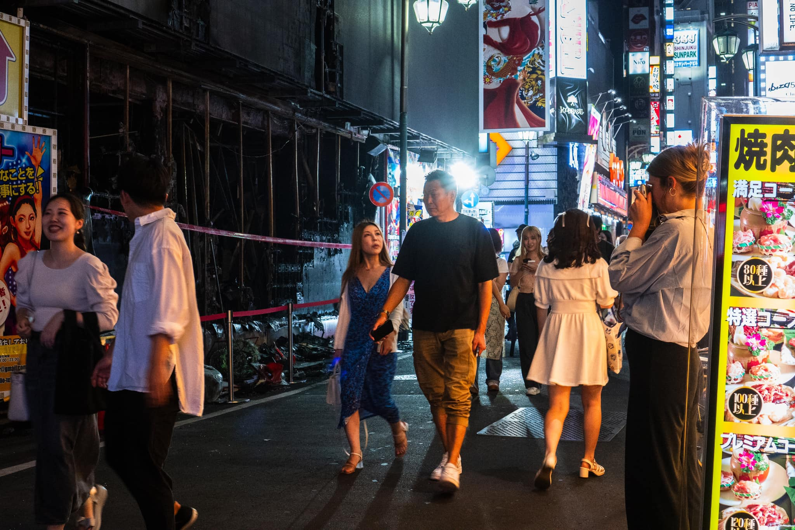
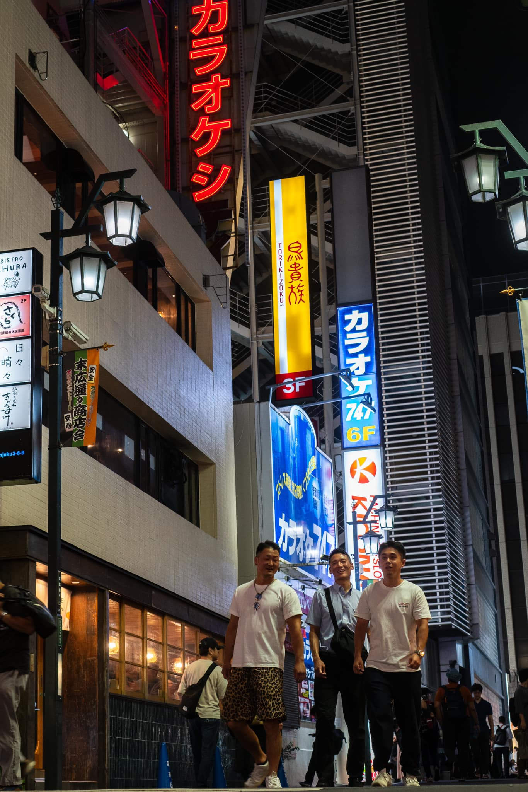
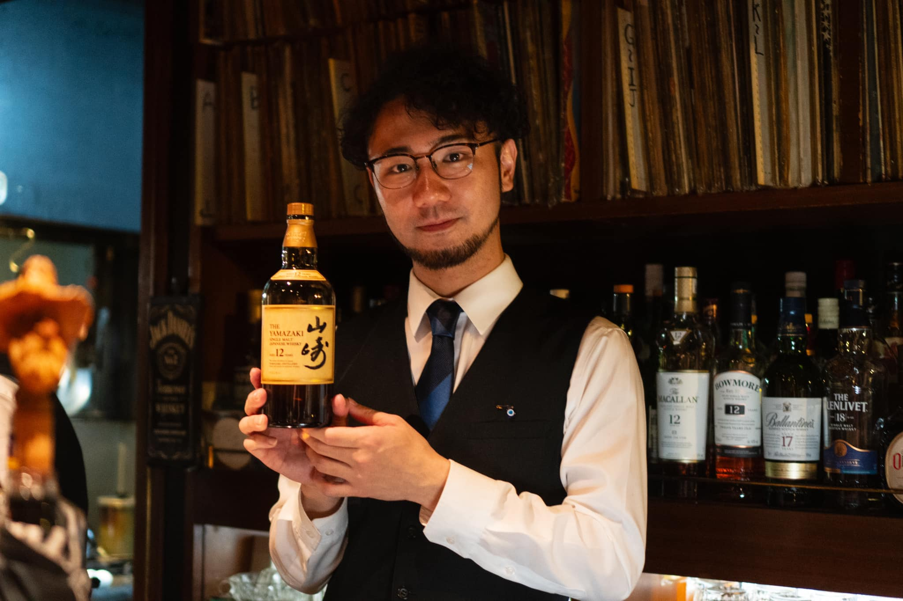
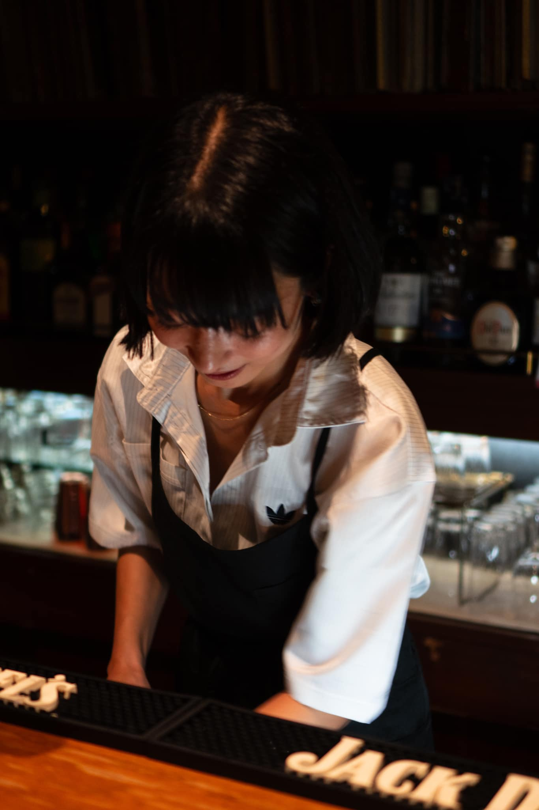
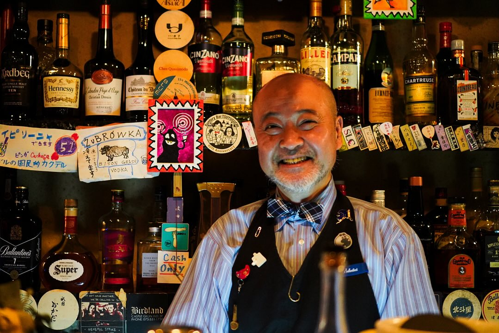
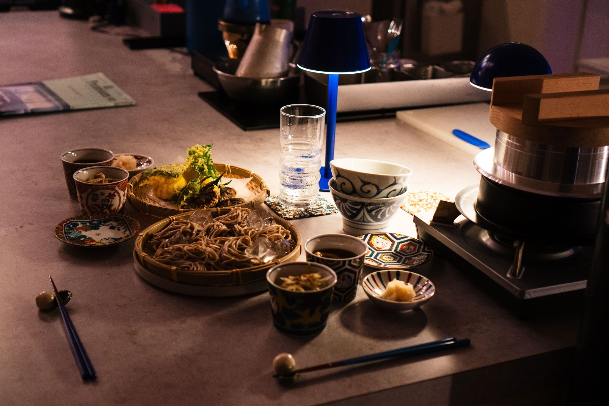
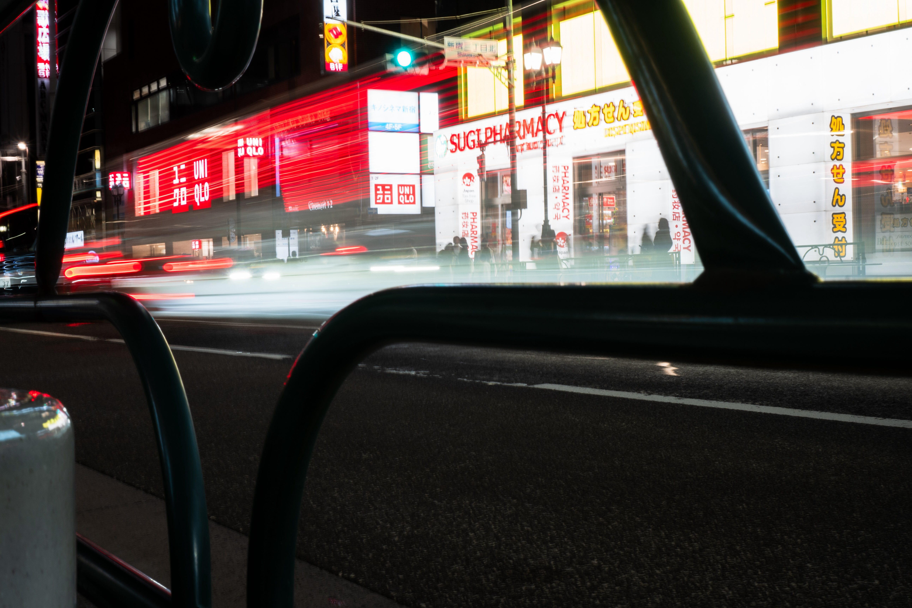

+++
title = "Twee maanden in Japan, vertoefd zonder plan"
date = 2024-08-26T21:22:11+01:00
draft = false
+++

Het zit er bijna op. Twee maanden in Japan, vertoefd zonder plan.

Ik heb een appartementje gehuurd in Tokyo. 
Wat even weinig specifiek is als zeggen “In Vlaanderen”.
Want Tokyo heeft geen specifiek centrum, het is een aaneensluiting van vele buurten.
Dus, meer specifiek, heb ik 2 maanden in Ootsuka gewoond, dat vlak naast Ikebukuro ligt.

In december vorig jaar kwam ik voor de eerste keer naar Japan. 
Reeds mijn hele leven fascineert Japan me. Toen ik op schoolreis naar Brugge met mijn neus op een standbeeld viel moest ik naar spoed.
En ik zei tegen de dokter nadat hij een kompres om mijn neus geduwd had. “Kijk, de vlag van Japan”.
Mijn vroegste herinnering als 10-jarige. Het stond in de sterren geschreven, tenminste in de sterren die ik zag na het vallen op mijn neus.

Maar goed, ik was dus spreker op een conferentie, en vertoefde in Tokyo voor 5 dagen. 
Die dagen vlogen voorbij, en mijn honger was allerminst gestild.
Zo een andere wereld, bijna te mooi om waar te zijn. Ik wou hier graag zijn en de cultuur absorberen.

Dus begon ik in februari met Japans te leren op Duolingo. Als je je hersens wilt pijnigen kan ik je Japans leren absoluut aanraden.
Woorden komen mijn ene oor in en vliegen er het andere weer uit. Als ik het woord 10 keer hoor blijft het met wat geluk hangen.
Als ik het 100 keer hoor kan ik het het even vlot uitspreken als een samurai. Helaas zijn er heel veel woorden.

En dan heb ik het nog niet over het alfabet.
Er is Hiragana, Katakana (wordt gebruikt om klanken van buitenlandse woorden te beschrijven, zoals kompyuuta, erebeeta, shoowaa, …) , en dan zijn er nog 1000-en kanji overgenomen van het Chinees.
Eén zin bevat meestal een mix van de 3, en spaties gebruiken ze niet dus moet je maar aanvoelen wanneer het volgende woord start.

Nu, we zijn een half jaar verder, en ik ben bijna op het niveau van een kleuter. 
Een kleuter die whisky kan bestellen in een bar, smakelijk kan zeggen en vooral weet hoe je beleefd een gesprek kan aanknopen.
Veel Japanners spreken amper Engels. En da’s ok, want het midden van de wereld ligt nu ook niet noodzakelijk in het Westen.
Dus de taal leren is de sleutel tot connectie maken met de locals. Het is al de hersenpijnigingen waard, en wordt enorm geapprecieerd.

Twee maanden klinkt lang, maar dat is het niet. Dagelijks krijg ik een beetje meer inzicht in de complexe cultuur, en ik heb nog zoveel te leren. Maar.. ik kan maar schrijven met wat ik nu weet, dus je zal het ermee moeten doen. 🙂

De afgelopen twee maanden waren niet zomaar een reis voor me, maar een ontdekking. 
Het is de eerste plek waar ik zo tot rust kom. Alhoewel ik weet dat dit voor velen van jullie niet noodzakelijk het geval zou zijn.
Spring dus alsjeblieft niet impulsief weg van je computer om je huis te verkopen en te emigreren. Ik wil dat niet op mijn geweten hebben.

Het ding is, Japan past toevallig heel goed bij mijn persoonlijkheid. De mensen zijn hier heel zachtaardig, veel wordt niet uitgesproken maar moet aangevoeld worden.
“Reading the air”
Japanners zijn heel verlegen, maar tegelijk heel geïnteresseerd en gewoonlijk blij als je een gesprek aanknoopt.
En eens ze in form zijn, kunnen ze vlot doorgaan tot 5u ’s ochtends, klinken ze steeds meer als samurai-s, en zingt zowat iedereen karaoke zonder gène.
Voor je het weet krijg je knuffels, en krijg je 100x dankje gezegd.

Veel “foreigners” zijn verward door al dat “lucht lezen”. Ik ga een voorbeeldje geven, heel toevallig uit een bar, heeft niks met mijn gewoontes te maken hoor… 🙂
Een pintje bestellen doe je niet door op de barman af te stappen en rechttoe rechtaan “een pintje” te zeggen. Da’s al een beetje te hard.
Eerst knik je, en zeg je vriendelijk goeiedag. Daarna vraag je vriendelijk een biertje.
Een subtiel verschil, maar een groot verschil. Dat je zowat naar iedere ontmoeting en interactie kan doortrekken.

Er is hier amper machogedrag. Een populaire uitdrukking is bv. “Yoroshiku onegai shimasu”. Los vertaald: “Wees alsjeblieft goed voor me”. 
Als je iemand voor de eerste keer ontmoet zeg je ook gewoonlijk “haji memashite”. Wat evenveel betekent als “Eerste keer”. 
Ik heb nog nooit zoveel met mijn hoofd geknikt als de voorbije 2 maanden, en doe dat ondertussen onbewust. 
In België zal ik dat wel snel weer afleren of jullie gaan denken dat er een paar (extra) vijzen loszitten bij me.

Japanners zijn ook heel stijvol. Niet noodzakelijk snobistisch, er zijn hier veel vintage winkeltjes bv, maar wel modueus.
Ook mannen dragen vaak juwelen en oorringen, hebben verzorgde haarsnit en zijn heel bewust over de kledij die ze dragen.
Je moet al goed je best doen om de aandacht te trekken met een originele look.

Amai, ik heb veel te vertellen eigenlijk. Ik ga nog wat dingen opsommen.

Japan is een heel goed georganiseerd land. De treinen zijn zo goed als altijd stipt, en er wordt standaard afgeroepen dat je liefst niet belt in de trein om anderen niet te storen.
Van 5u ’s ochtends tot middernacht kan je hier met het openbaar vervoer in Tokyo zowat overal naartoe. En mis je de laatste trein? Dan kan je ofwel een dutje doen in een love hotel. 
Daar zijn er vele van, in allerlei thema’s (een auto, een treinwagon, you name it, you can find it). Of je kan naar een bar tot 5u ’s ochtends. Da’s zowat standaard sluitingsuur van vele bars. 

Er is heel veel traditie in Japan. Shinto en boedhisme zijn de populairste religies, worden vaak gecombineerd, maar veel Japanners gaan er los mee om.
Veel mensen zijn agnostisch, maar ze geloven dus wel vaak dat er in vanalles een ziel zit, in bergen, rivieren, ...
De traditie zie je ook in de straten. Tussenin de volgebouwde smalle straten met betonnen gebouwen zijn er ook izakaya’s (een soort traditionele café waar je ook kan eten), restaurants, tempeltjes,  … die traditie ademen. 

Japan is super proper, en zowat nergens staat er een publieke vuilbak. Dat komt omdat ze reeds als kind zelf hun school moeten kuisen, incl. toiletten.
Als werknemer is het ook normaal dat je zelf instaat voor het kuisen van je café of restaurant. 
Rokers hebben vaak een “pocket ashtray” bij zodat hun peukjes niet op de grond belanden.
Zowat iedere stoep of treinstation ligt er dan ook vlekkeloos bij. Echt indrukwekkend, wat een verschil met Brugge waar velen al te tam zijn om hun blik in een vuilbak te gooien ondanks de vele vuilbakken.

Als iets schattig kan gemaakt worden, dan zal het schattig gemaakt worden. Alles wordt hier schattig gemaakt, “kawaii”, het is ook het woord dat ik het vaakst hoor hier.
Veel zaken worden ook benoemd zoals ze aanvoelen, zoals “mochi mochi”, iets dat zacht is. You feel it right.

Japanners zijn een gemiddeld een stuk kleiner dan Belgen. Ik ben 1m79 en ben al zowat aan de bovengrens om hier comfortabel te kunnen leven.
Er zijn hier tunnels die maar 1m80 hoog zijn, als ik mijn handen was moet ik serieus buigen, en als ik niet op let stoot ik mijn hoofd gemakkelijk 10x per dag.
Als je 10cm groter bent dan me zal je jouw huis moeten verbouwen of een hernia-verzekering nemen.

Japanners werken superhard, en er is veel druk. Op je werk spreek je best niet tegen, maar s avonds met collega’s drinken en tipsy zijn is daarentegen volledig acceptabel. Dronken op straat slapen kijkt ook niemand echt van op. De druk moet van de ketel, het zijn uiteindelijk ook mensen zoals ons.

Hotsprings, onsens, zijn heel populair. En super gezellig. Je moet er wel in je blootje lopen, maar geen zorgen, meestal worden de seksen gescheiden.
Ik ben daar 2x naartoe geweest en ondertussen behoorlijk comfortabel om in een bad vol mannen te liggen, tot ik zo rood als een octopus word en verkoeling moet zoeken.

Veel Japanse mensen bruinen niet graag. Je ziet hier alle mogelijke attributen om toch maar de zon te weren van je huid. 
Ook heel veel paraplutjes. Eindelijk zijn mijn witte kuiten het summum van een schoonheidsideaal, dat had ik nooit verwacht te ervaren.

In 2 maanden heb ik me nooit onveilig gevoeld, zelfs in de smalste straatjes van de uitgaansbuurten in het midden van de nacht. 
Mijn smartphone, laptop of portefeuille kan ik gerust laten rondslingeren, de kans dat iets gestolen wordt is miniem.

Om de 200 meter zijn er hier “konbini’s”, kleine supermarktjes, die 24/7 open zijn. Letterlijk. En waar je zelfs je belastingsaangifte kan doen, betalingen, kopies maken, een t-shirt kopen, …
Ik ga dat missen, zo praktisch. Wel gevaarlijk ook, een mens die geen limieten kent kan hier ieder moment van de dag een drankje halen.

Roken is hier heel bizar. Er is zowat overal in de publieke ruimte een rookverbod. Daarvoor moet je naar een “smoking area” waarvan er niet veel zijn.
Of.. naar een bar, in veel bars mag je binnen roken. De omgekeerde wereld, very rock’n roll maar niet bepaald gezond of smakelijk. Er zijn uiteraard ook veel bars waar ze er niet van moeten weten, of een rokerszaaltje hebben. Maar ik ben toch precies teruggekatapulteerd naar 2007.

Op dit moment is het voor ons heel betaalbaar om in Japan te vertoeven, omdat de Yen het niet goed doet.
Je kan vlot gyoza’s eten, Ramen en een halve liter bier drinken voor alles samen 11 Euro. Ik heb dus niet veel gekookt sinds ik hier ben. 🙂

Ok, ik ben het bijna beu van te typen. En moet ook nog iets te vertellen hebben als ik je zie. Dus nog één indruk.
Japanners zijn super vindingrijk. Een oogmasker dat opwarmt als je het uit de verpakking haalt. Check
Een bodysuit dat je afkoelt, check. Toiletten die na het doorspoelen bijvullen via een kraantje zodat je meteen ook je handen kan wassen, check.

Zaterdag vlieg ik terug, maar ik ben al aan het denken hoe ik hier terug kan komen. 
Ik heb hier mijn hart verloren, helaas is het heel ver van alles wat me dierbaar is in België (vooral jullie, mijn familie en vrienden, de rest zou ik kunnen missen).
Hopelijk heb je iets bijgeleerd over dit fascinerende land. 🙂

