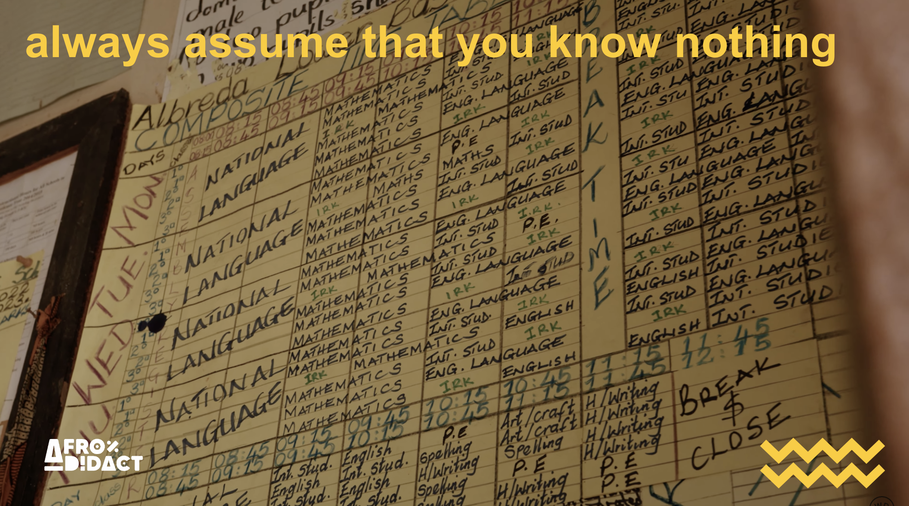
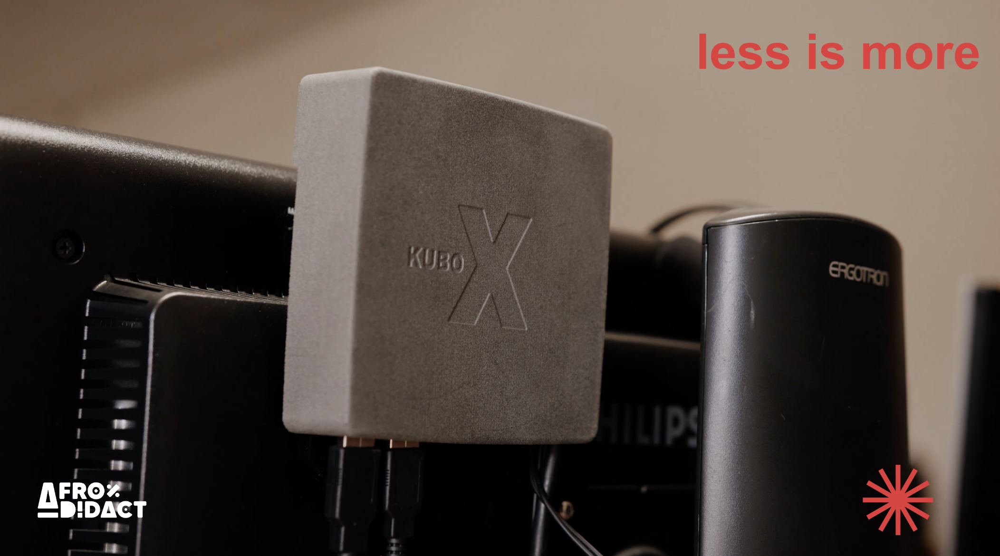
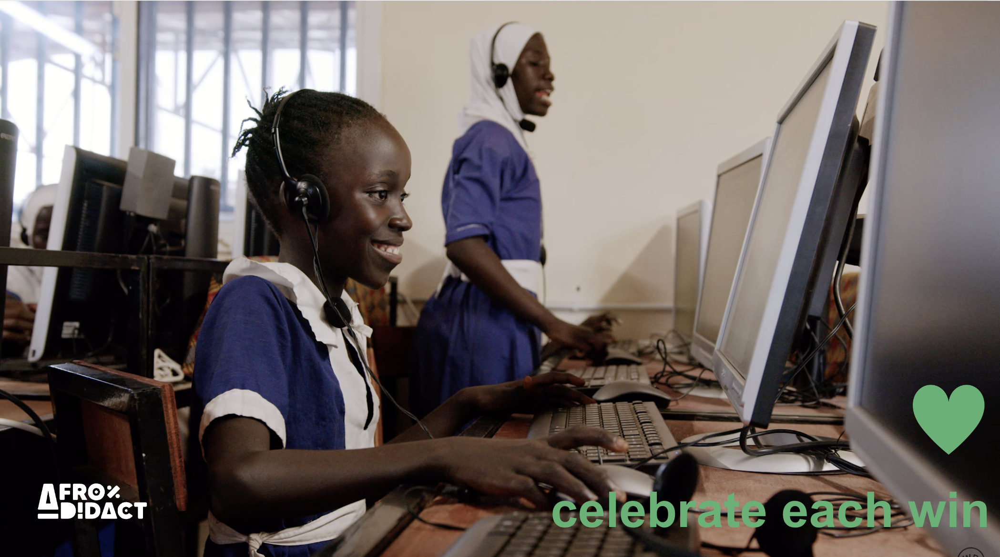
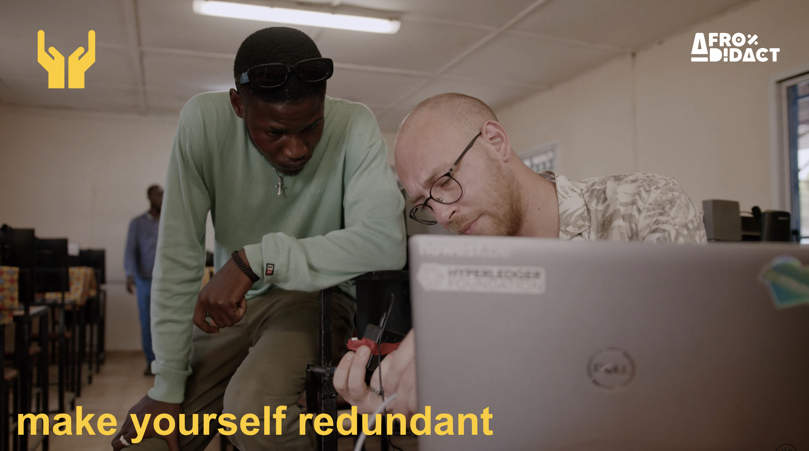

+++
title = '4 Lessons Learned from 7 Years of Implementing IT in Gambian Schools'
date = 2024-11-10T17:40:00
draft = false
+++

Since 2017, we have been deeply involved in the non-profit organization Afrodidact, which aims to provide quality education for every child. We’re currently focused on The Gambia, and within Afrodidact, our digital solutions pillar is KUBO—a project we have been building with an ever-growing team of dedicated volunteers.

On October 8, 2024, Educaid – Belgium’s educational aid organization – hosted its International Conference on "Leveraging Technologies for Inclusive Quality Education." This topic felt like a perfect fit for our work, so we reached out to participate. After considering what to present, we decided to take a step back and share the key lessons we’ve learned, hoping they would be useful to others working in similar fields.

Our talk, titled **"Lessons Learned from 7 Years of Implementing IT in Gambian Primary Schools,"** shared both challenges and successes. Here are the core lessons we presented:

## Lesson 1: Always Assume You Know Nothing

During my first stay of four months, I thought I understood the local context. Seven years and ten visits later, I’ve learned that every trip reveals new layers and insights. In education and development, there are often many dynamics at play that aren’t immediately visible. We’ve learned to stay humble and keep in mind that there’s always more to learn, helping us avoid mistakes or unexpected side effects when making changes.

## Lesson 2: Keep it Simple, but Not Simpler Than Possible

In complex environments, simpler solutions work best and carry fewer risks. Quick fixes might work in the short term when motivation and resources are high, but for lasting impact, simplicity is key—but not simpler than is practical. At KUBO, we try to use locally available materials as much as possible, including second-hand components. If something isn’t locally available, we import essentials, such as Raspberry Pi, and only build custom parts, like our KUBO X casing, as a last resort. This approach balances practicality with scalability, ensuring that our model can grow sustainably.

We take the same approach with software, using well-known tools like Raspbian, LibreOffice, Rachel server, and Kolibri. The only custom tools we created are a school server and a backup system through a SIM dongle with a remote management feature. Keeping our solutions simple ensures they can remain effective even when we aren’t there to support them directly.

## Lesson 3: Celebrate Every Win

Innovation comes with risks, especially in challenging settings where there may be fewer solid foundations to build upon, and where unexpected challenges can disrupt plans. While big dreams inspire us, we focus on setting achievable milestones. This approach allows us to:
- Test our ideas and make improvements, which lowers risks over time
- Keep stakeholders motivated, including beneficiaries, team members, funders, and even skeptics
- Attract new supporters, resources, and partners

Every win, no matter how small, represents a step forward. Celebrating these successes keeps everyone involved motivated and engaged.

## Lesson 4: Make Yourself Redundant

One of our guiding principles is to work toward making our roles unnecessary over time. This work isn’t about making ourselves important—it’s about building sustainable systems that can operate independently. At every level, we include local stakeholders, including the Ministry of Basic and Secondary Education, schools, teachers, local IT staff, and volunteers, to ensure the project is rooted locally.

We recognize that it’s not always possible to find all resources—whether financial or knowledge-based—locally. However, our goal is always to pass on knowledge and responsibilities wherever we can. True sustainability is about aligning with the community’s needs and planning for long-term engagement, so that the project can thrive even when we’re no longer involved.

## Looking Ahead

These lessons reflect our ongoing journey with KUBO in The Gambia, reminding us that real change requires patience, humility, and flexibility. By keeping our solutions simple, celebrating every step forward, and aiming for a sustainable model that doesn’t rely on us, we hope to create a foundation for lasting impact.

If you’re interested in learning more about KUBO or exploring how to implement similar solutions in your own educational projects, we’d love to connect. We’re grateful for our dedicated volunteers, partners, and everyone who shares our vision for quality education for every child. Together, we can make meaningful strides toward a future where every child has access to the tools they need to learn, grow, and thrive.

You can watch the full recording of our talk here: [YouTube Link](https://youtu.be/4i6t8l3wg6c?si=p1LIdhWU2wRe1yhW)
