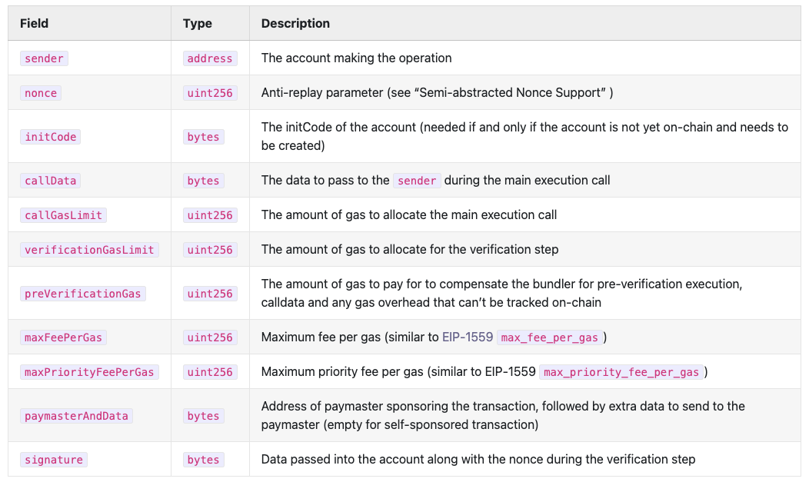
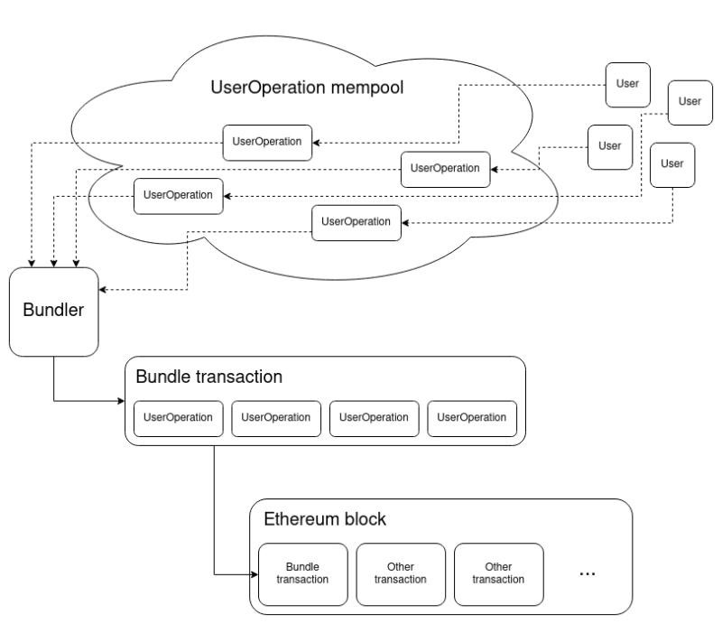

+++
title = "Account Abstraction, a Game Changer for Web3's UX issues"
date = 2023-12-30T18:16:51+01:00
draft = false
+++

The promise of Web3 lies in its potential to create a decentralized internet where users have control over their data and transactions. However, the path to this new dawn is obstructed by significant user experience (UX) challenges. The complexity of managing gas fees in Ether, the fear of losing cryptographic keys, and the technical hurdles in setting up multisig accounts have all been significant barriers to widespread adoption.

In the Ethereum ecosystem, users traditionally interact with the network through two types of accounts: Externally Owned Accounts (EOAs) and contract accounts.

Both lie at the heart of the  consensus layer, the secure bedrock of blockchain technology. Any modification at this level is an intricate and resource-intensive undertaking. In case not all participants agree to upgrade, it can even result in a hard fork. A divergence from the previous version of the blockchain, resulting in two separate chains.

But there's a clever way to overcome the limitations of EOAs, without changes needed to the consensus layer:  Account Abstraction (AA), as proposed in  [ERC-4337](https://eips.ethereum.org/EIPS/eip-4337). Account Abstraction seeks to simplify the blockchain experience by abstracting the complexities of user accounts into a form that feels familiar to the everyday user.

Under the ERC-4337 standard (which is still in ongoing development), an account is no longer just an EOA but a  smart contract  in itself. This paradigm shift allows for programmable logic to be embedded directly into the account, enabling a wide range of functionalities and recovery mechanisms. Like any traditional account, it can hold Ether, ERC-20 tokens, and NFTs, but with the added benefit of programmable flexibility.

Alice & Bob, different generations of Web3 onboarding
-----------------------------------------------------

Sounds still abstract? I get you, don't worry. I'll try my best to make the potential tangible.

Let me introduce to you: Alice & Bob. They recently had a coffee date as it was years since they last met.

Bob reminded Alice of his traumatic memories managing his assets on Ethereum. It turns out he got into the Web3 space very early, and collected plenty of tokens and NFTs of which some turned out to become quite valuable. The only problem is that despite his curiosity, he wasn't too careful. He got scammed and lost a CryptoPunk. Furthermore, the device that held his wallet crashed a year later, and he couldn't remember where he put the passphrase to regain access. All the value, gone in smoke.

Alice however comes from a different onboarding generation. A year ago she attended an exclusive digital design conference, and was gifted an NFT by a designer that was showcasing his Web3 blended works. All she had to do was visit a website, connect with her LinkedIn account, and scan a code. That was it.

When she told Bob the story, he wasn't convinced. "Not your keys, not your coins, my friend". Alice lifted her finger and told her story wasn't finished yet.

Alice told that during the next year, she collected more NFTs and decided that she wanted to pay a bit more attention to it. Her wallet reminded her that she could  claim  ownership over her account. She could choose between a passphrase, but also using the fingerprint on her phone or a hardware device were among the options. Furthermore the wallet ensured her that she didn't have to transfer NFTs.

She even selected friends as guardians that could help her regain access to her account, and in case something terrible happened and she wasn't active for a year, her spouse would be notified that he could claim all the funds in the account.

Alice turned from mildly interested to an advanced user, all with the same account, and still with safety feedbacks. If only Bob had these available years earlier... Because this wouldn't be possible without Account Abstraction!

*↑ Thirdweb's user interface for Account Abstraction could inspire the story above, even though it doesn't provide all the mentioned functionalities.*

### How is this achieved?

*↑ Insightful diagram by Thirdweb*

Under the ERC-4337 standard, an account is no longer just an EOA but a  smart contract  in itself. This paradigm shift allows for programmable logic to be embedded directly into the account, enabling a wide range of functionalities and recovery mechanisms. Like any traditional account, it can hold Ether, ERC-20 tokens, and NFTs, but with the added benefit of programmable flexibility.

With ERC-4337, wallets that interact with the blockchain are relieved from direct communication with the consensus layer. Instead, they create  User Operations  (UserOps) that encapsulate the intended actions of the user. These UserOps, though not directly recognised by the blockchain, are interpreted by an  EntryPoint  contract which sits at a layer above the consensus.

*↑ Components of an UserOperation*

Bundlers  play a crucial role in this new architecture. They gather  UserOps  from various users and submit them to the  EntryPoint  contract, effectively acting as intermediaries that bridge the gap between user intentions and blockchain execution.

*↑ Diagrams by Vitalik Buterin*

In this evolved ecosystem, a  Paymaster  contract can take on the responsibility of handling gas fees, which smooths out the interaction process with the blockchain. The Paymaster can cover the transaction fees, offering a more user-friendly experience akin to the conventional web. It can also enable paying for gas fees in tokens.

### ERC-1271 enabling diverse Signature Schemes

Central to the versatility of ERC-4337 is ERC-1271's isValidSignature function, which allows for the integration of various signature schemes within the Account Abstraction contract. This flexibility means that the blockchain can now go beyond the Elliptic Curve Digital Signature Algorithm (ECDSA) and support:

-   more efficient cryptographic algorithms like Schnorr,
-   user-friendly options leveraging smartphone secure enclaves,
-   and even quantum-resistant signatures, ensuring a future-proof security model,
-   ....

### Beyond Traditional Use Cases

Account Abstraction opens the door to innovative use cases such as temporary access management, automated conditional transactions, and enhanced security protocols.

ERC-4337 is not just another update in the blockchain space; it's a radical rethinking of how we interact with EVM-chains. By abstracting away the complexity of traditional blockchain operations and offering a user experience that feels both natural and intuitive. The fact that it's a programmable smart contract makes it possible to make it upgradeable, interoperable, ...

The limit will truly be our creativity.

### Further reading:

Interesting  [misconceptions](https://docs.zerodev.app/blog/erc-4337-misconceptions-and-valid-concerns)

[Entrypoint contract](https://etherscan.io/address/0x5ff137d4b0fdcd49dca30c7cf57e578a026d2789#code)  by Ethereum Foundation,  [audited](https://blog.openzeppelin.com/eth-foundation-account-abstraction-audit)  by Openzeppelin