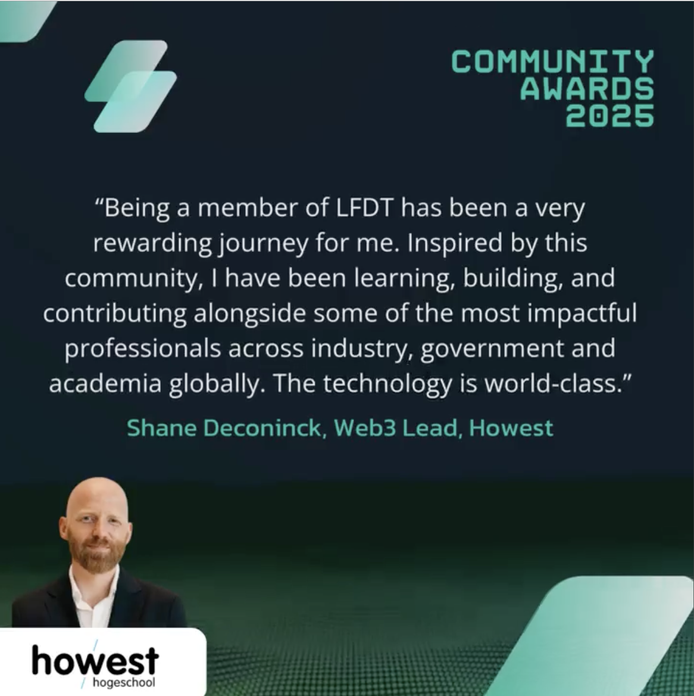

Finishing off 2025 with a high: I'm really honored to be recognized as a [2025 LF Decentralized Trust community awardee](https://www.lfdecentralizedtrust.org/blog/2025-community-awards-recognizing-contributions-from-across-the-lf-decentralized-trust-community). 😳😊

This year's awards celebrate a decade of building better together, recognizing 10 contributors across code development, community building, and education. I'm humbled to be among awardees including the IBM Research team, the Kaleido founding team, and leaders from Indicio, FUJITSU, University of Guelph, and more.

At Howest Cyber3Lab, we've been building with LFDT/Hyperledger technologies since 2017. Becoming a LFDT member and serving as LFDT Belgium Meetup host has been mutually beneficial for researchers, students, industry partners, and the wider community. And the LFDT European Chapter we co-founded (thanks Espeo Software!) is gaining momentum now too.

So I'm grateful, to my colleagues (Kushal, Wim, Robby, Scott, Patrick, ...), to LF Decentralized Trust (Daniela, Hart, Julian, Tomaz, Karen, Emily, David, ...), to the LFDT members and to our LFDT Belgium Meetup group members.

Through serving I'm gaining, and to me that's what open source is all about. 🙏

#BuildingBetterTogether